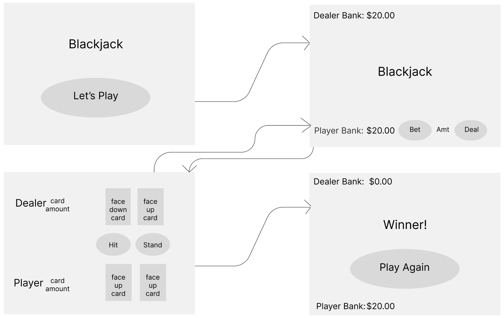

# Project 1 Blackjack - Planning Documents

## Wireframe

---

## MVP

### As a user, I want to:

- Click a button and begin the game.
- See how much money I am starting with in my bank.
- Click a button and bet in whole dollar amounts.
- Be stopped if I have not bet before my hand is dealt.
- Click a button and my hand and the dealer's hand is dealt.
- Once dealt, be able to clearly see my cards and the dealer's one face-up card and face-down card.
- Choose to "hit" or "stand" based on my cards.
- Once I stand, deal cards to the dealer.
- Be informed if I have won the hand or not.
- Be informed of how much money is left in my bank.
- Be able to bet again and be dealt cards again.
- Once the dealer or myself is out of money, be informed that I have won the pot or not.
- Be able to fully start the game over and play again.

---

## MVP Pseudocode

### Variables for working with DOM

- `// declare variable for play button`

- `// declare variable for bet button `

- `// declare variable for deal button `

- `// declare variable for "hit" button `

- `// declare variable for "stand" button `

- `// declare variable for play again button `

### Data Structures

- `// array of objects for cards (key will be name of card, value will be the number)`

- `// create new "shuffled" array with array of objects for cards randomized `

- `// variable to store dealer bank amount (may be located in render function so that it can be reset) `

- `// once hand is dealt, temporary variable to store how close dealer is to 21 (card amount) (may be located in render function so that it can be reset) `

- `// variable to store player bank amount (may be located in render function so that it can be reset) `

- `// once hand is dealt, temporary variable to store how close player is to 21 (card amount) (may be located in render function so that it can be reset) `

- `// variable to store temporary "pot" amount (this may be local in scope within a function)`

- `// variable to store the amount the user will bet.  This will come from an input form`

### Gameplay functionality

- `// initialize function called immediately to display phase one (first screen)`

- `// render function to start the game play and display the banks, the bet button, the amount input form, and the deal button.  Will be added to play button as event listener `

- `// Upon the bet button being clicked, if the bet amount within the input form is not empty, store the bet amount within the temporary pot `

- `// Upon the deal button being clicked, display the third screen, show the hit and stand buttons, and give the user two cards shown and the dealer with only one card shown and another facedown`

- `// Player functionality - upon clicking the hit button, the user will be given a random "card". They can continue to click hit until they either bust (get over 21), get 21, or click the stand button `

- `// Dealer functionality - to be called once the stand button is clicked. Dealer's facedown card will show. Cards will be "given" to the dealer until they get between 17 and 20, get 21 and win, or "bust" (get over 21). Note, if the dealer gets between 17 and 21, the functionality MUST stop (may have to incoporate some setTimeouts for giving cards to dealer)`

- `// upon completion of Dealer's functionality, the page will the display winner of that hand, and then the user will be brought back to the second phase with updated bank amounts.  Bank amounts will be updated based on who won the temporary pot. (if they win a hand, give them back double. If they win a hand with black jack, give them back what they bet plus 150%) Continue this until dealer or player's bank amount is at 0 `

- `// upon player or dealer's bank amount getting to 0, show fourth phase with "Winner" or "Loser" `

- `// play again button to start the game over. (may be the same function as render)`

### Event Listeners

- `// event listener for play button that will display the second game play phase and kick off initialize functionality `

- `// event listener for bet button to bet a specific whole dollar amount`

- `// event listener for the deal button to display the third phase with hit and stand buttons and 'deal the cards' `
- `// event listener for the hit button to run the player functionality `

- `// event listener for stand button to stop dealing to player, once this button is clicked, then run the dealer functionality`

- `// event listener for play again button, will be similar if not the same function as render`

---

---

## v2 User Stories

### As a user, I want to:

- See better UX/UI design. (setTimeouts, css transitions, css transforms).
- Have the ability to pick my theme.
- Have the ability to choose how much money myself and the dealer start with.
- Use buttons(chips design) for quick selection of an amount to bet.

---

## v3 User Stories

### As a user, I want to:

- Have the ability to play with 2-4 people.
- Have audio telling me how much my hand has.
- Have the ability to bet in 25 cent increments.
- Have the ability to split hands.
- See the concept of "insurance" implemented.
- See all time statistics vs. the computer.
