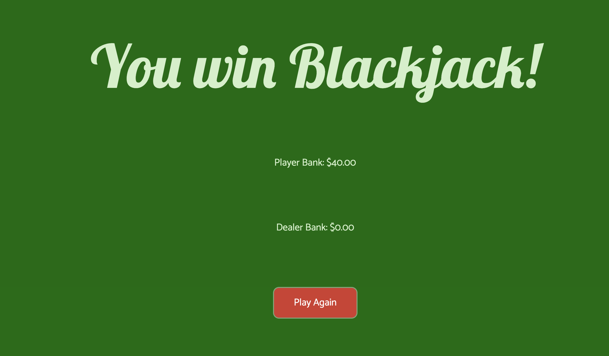

# Blackjack

Blackjack is a card game where both the dealer and the player are dealt a hand of cards and the player bets against the dealer. Whoever gets closest to 21 without going over wins the pot.

---

## Technology Used:

---

The following technology was used in order to create Blackjack:

- JavaScript
- HTML
- CSS

## Getting Started

---

To play this game live you can click this [link](https://paulseabrook.github.io/project-1/)

### Game Rules

- For this initial version, aces will consistently be worth 11.
- Player and dealer banks start at $20.00.
- The player or dealer wins if they have a hand that is greater than the other or if the other busts and goes over 21.
- If both players have the same number, they will push and the player and dealer banks will remain the same.
- The dealer stops receiving cards once they have a "Dealer Card" amount that is greater than 16.
- If the player wins Blackjack, they receive the normal bet amount times 2.
- The player wins the complete game once the dealer bank is 0.

### Instructions

- Click "Let's Play" to begin.
- Input a whole number amount less than or equal to your "Player Bank" amount.
- Click the "Bet" button.
- Click the "Deal" button.
- Click "Hit" based on the "Player Card" amount in lower left hand corner.
- When satisfied with "Player Card" amount, click "Stand".
- The dealer's second card will be shown and the dealer will receive cards until their "Dealer Card" amount is greater than 16.
- The player will win or lose the hand, the player and dealer banks will be updated, and the player will be able to bet and be dealt cards again.
- Continue playing hands until the player wins or loses by running out of money.
- To play a new game and reset the banks, click "Play Again".

## Next Steps

---

### Version 2:

- As a user, I want aces to be equal to 1 or 11 depending on the situation.
- As a user, I want to see better UX/UI design. (setTimeouts, css transitions, css transforms).
- As a user, I want to be able to pick my theme.
- As a user, I want to be able to choose how much money myself and the dealer start with.
- As a user, I want to be able to use buttons (chips) for quick selection of an amount to bet.

### Version 3:

- As a user, I want to be able to play with 2-4 people.
- As a user, I want to have the option of audio telling me how much my hand has.
- As a user, I want to be able to bet in 25 cent increments.
- As a user, I want to have the ability to split hands.
- As a user, I want to see the concept of "insurance" implemented.
- As a user, I want to see all-time statistics vs. the computer.
